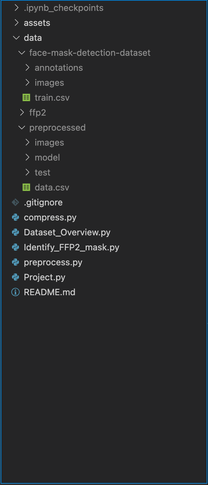

# The structure of the `data` directory is below
[Google Drive: Dataset and Trained Model](https://drive.google.com/drive/folders/1vluVjmupf8uZ587-2IWbWxSmfcI302UZ?usp=sharing)
- data
  - preprocessed
    - images
    - model
      - face_mask_detection.pth
    - test
    - original_images
    - data.csv
- `data/images` contains the image dataset, compressed images.
- `data.csv` has the records mapping each image file with its classname
- `model/face_mask_detection.pth` Trained model
- `test` Put your image file to predict a class label
- `original_images` Images before compressing.

# Explanation of project files
### Project.py
- Main project file to analyze face images and detect whether a person is wearing a face mask or not, as well as the type of mask that is being worn.

### Dataset_Overview.py
- Shows the overview of the dataset

### Identify_FFP2_mask.py
- Model to idenfity images with FFP2 mask from the separate dataset (which is not the main dataset).
- This will help to make collect the image files of FFP2 mask for the main dataset.
  
### preprocess.py
- To pre-process data.

### compress.py
- Compresses the image files to reduce the file size.

## The below image shows the project structure:

## To Run Code
- Run Project.py file
### Running the project.py will go through the below phases:
1. Import libraries
2. Set the required paths
3. Read data csv file
4. Functions for the below purposes
   1. To get image file data (getImageData)
   2. To create directory (make_dir)
5. Predefined classes
6. Custom dataset class (FaceMaskDataset)
7. Shuffle and split data for training, valdiation and testing
8. Define transform function
9. Load the training and validation data and create dataloaders
10. Identify which device to use
11. Create base class for classification (FaceMaskClassificationBase)
    1.  training_step
        1.  Trains the model
        2.  Finds and returns the loss
    2.  validation_step
        1.  Validates the model
        2.  Finds the accuracy
    3. validation_epoch_end
        1. Finds the validation loss and accuracy at the end of each epoch
    4.  epoch_end
        1. Prints the neccesary information after the completion of epoch
12. Define Convolution Nueral Network model (CNN)
    1.  Implements the FaceMaskClassificationBase class
13. Helper methods
    1.  Calculate accuracy (accuracy)
    2.  Evalute the model (evaluate)
    3.  Fit the data to model (fit)
14. Show the Accuracy vs. No. of epochs plot (plot_accuracies)
15. Show the Training and validation loss vs. No. of epochs (plot_losses)
16. Load testing data
17. Test the model and find accuracy
18. Show confusion matrix
19. Find precision, recall, f1-score, and support
20. Method to get class name using label (label_to_classname)
21. Get new images from the specified path
22. Predict the labels for the new image data